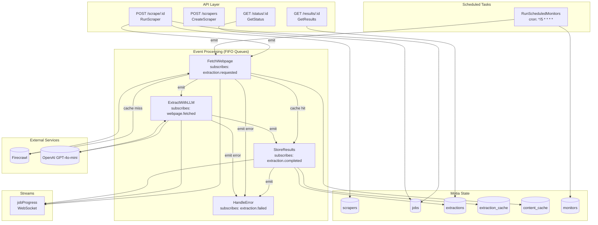

# Web2API Architecture

> Turn any website into a structured JSON API using AI - no selectors, no code.

## System Overview

```
┌─────────────────────────────────────────────────────────────────────────────────┐
│                                  WEB2API                                        │
│                                                                                 │
│  ┌─────────────┐     ┌──────────────────────────────────────────────────────┐  │
│  │   Next.js   │────▶│                  MOTIA RUNTIME                       │  │
│  │  Frontend   │     │                                                      │  │
│  └─────────────┘     │  ┌────────────────────────────────────────────────┐  │  │
│                      │  │              API STEPS (Python)                │  │  │
│                      │  │  • POST /scrape/:id     → RunScraper           │  │  │
│                      │  │  • POST /scrapers       → CreateScraper        │  │  │
│                      │  │  • GET  /scrapers       → ListScrapers         │  │  │
│                      │  │  • GET  /status/:id     → GetStatus            │  │  │
│                      │  │  • GET  /results/:id    → GetResults           │  │  │
│                      │  └────────────────────────────────────────────────┘  │  │
│                      │                      │                                │  │
│                      │                      ▼ emit("extraction.requested")   │  │
│                      │  ┌────────────────────────────────────────────────┐  │  │
│                      │  │           EVENT STEPS (Python)                 │  │  │
│                      │  │  • FetchWebpage    → subscribes: extraction.*  │  │  │
│                      │  │  • ExtractWithLLM  → subscribes: webpage.*     │  │  │
│                      │  │  • StoreResults    → subscribes: extraction.*  │  │  │
│                      │  │  • HandleError     → subscribes: extraction.*  │  │  │
│                      │  └────────────────────────────────────────────────┘  │  │
│                      │                                                      │  │
│                      │  ┌────────────────────────────────────────────────┐  │  │
│                      │  │            CRON STEPS (Python)                 │  │  │
│                      │  │  • RunScheduledMonitors → cron: */5 * * * *    │  │  │
│                      │  └────────────────────────────────────────────────┘  │  │
│                      │                                                      │  │
│                      │  ┌────────────────────────────────────────────────┐  │  │
│                      │  │           MOTIA INFRASTRUCTURE                 │  │  │
│                      │  │  • State Manager (Redis)                       │  │  │
│                      │  │  • FIFO Queues with Retry                      │  │  │
│                      │  │  • WebSocket Streams                           │  │  │
│                      │  │  • Structured Logging                          │  │  │
│                      │  └────────────────────────────────────────────────┘  │  │
│                      └──────────────────────────────────────────────────────┘  │
│                                          │                                      │
│                      ┌───────────────────┼───────────────────┐                  │
│                      ▼                   ▼                   ▼                  │
│               ┌────────────┐      ┌────────────┐      ┌────────────┐           │
│               │ Firecrawl  │      │  OpenAI    │      │   Redis    │           │
│               │  (Scrape)  │      │ GPT-4o-mini│      │  (State)   │           │
│               └────────────┘      └────────────┘      └────────────┘           │
└─────────────────────────────────────────────────────────────────────────────────┘
```

---

## Motia Step Architecture

### Event Flow Diagram



---

## Step Inventory

### API Steps (9 total)

| Step | Path | Method | Purpose |
|------|------|--------|---------|
| `CreateScraper` | `/scrapers` | POST | Create scraper with JSON schema |
| `ListScrapers` | `/scrapers` | GET | List all scrapers |
| `GetScraper` | `/scrapers/:id` | GET | Get scraper details |
| `RunScraper` | `/scrape/:scraperId` | POST | Execute scraper on URL |
| `GetStatus` | `/status/:jobId` | GET | Poll job status |
| `GetResults` | `/results/:jobId` | GET | Get extraction results |
| `ListMonitors` | `/monitors` | GET | List scheduled monitors |
| `DeleteMonitor` | `/monitors/:id` | DELETE | Remove monitor |
| `StateVerification` | `/debug/state` | GET | Debug state inspection |

### Event Steps (4 total)

| Step | Subscribes | Emits | Purpose |
|------|------------|-------|---------|
| `FetchWebpage` | `extraction.requested` | `webpage.fetched`, `extraction.completed`, `extraction.failed` | Fetch URL, check cache, scrape |
| `ExtractWithLLM` | `webpage.fetched` | `extraction.completed`, `extraction.failed` | AI extraction with GPT-4o-mini |
| `StoreResults` | `extraction.completed` | `results.stored`, `extraction.failed` | Validate, store, cache results |
| `HandleExtractionError` | `extraction.failed` | - | Update job status, log errors |

### Cron Steps (1 total)

| Step | Schedule | Purpose |
|------|----------|---------|
| `RunScheduledMonitors` | `*/5 * * * *` | Check due monitors, trigger fresh scrapes |

### Streams (1 total)

| Stream | Purpose |
|--------|---------|
| `jobProgress` | Real-time progress updates via WebSocket |

---

## How Motia Features Are Used

### 1. State Management

Large payloads stored in state to avoid 4KB event limit:

```python
# Store schema for downstream steps
await context.state.set("job_payloads", job_id, {"schema": schema})

# Retrieve in event handler
payload = await context.state.get("job_payloads", job_id)
```

**State Groups Used:**
- `scrapers` - Scraper configurations
- `jobs` - Job metadata and status
- `job_payloads` - Schema for event steps
- `fetch_payloads` - Markdown content between steps
- `extraction_payloads` - Extracted data before storage
- `extractions` - Final results
- `extraction_cache` - Cache by URL + schema hash
- `content_cache` - Cache by URL hash only
- `monitors` - Scheduled monitoring configs

### 2. Event-Driven Architecture

Decoupled processing with topic-based messaging:

```python
# API Step emits to topic
await context.emit({
    "topic": "extraction.requested",
    "data": {"job_id": job_id, "url": url},
    "messageGroupId": job_id  # FIFO ordering
})

# Event Step subscribes
config = {
    "subscribes": ["extraction.requested"],
    "emits": ["webpage.fetched", "extraction.failed"]
}
```

### 3. FIFO Queues with Retry

Infrastructure configuration for reliable processing:

```python
"infrastructure": {
    "handler": {"ram": 512, "timeout": 60},
    "queue": {
        "type": "fifo",
        "maxRetries": 3,
        "visibilityTimeout": 90
    }
}
```

### 4. Real-time Streaming

WebSocket progress updates to frontend:

```python
await context.streams.jobProgress.set(job_id, job_id, {
    "status": "extracting",
    "progress": 60,
    "message": "Extracting with GPT-4o-mini..."
})
```

### 5. Structured Logging

Contextual logging with trace IDs:

```python
context.logger.info("Processing extraction", {
    "job_id": job_id,
    "url": url,
    "use_cache": True
})
```

### 6. Multi-language Support

All steps in Python with service layer pattern:

```
steps/
├── api/          # 9 Python API steps
├── events/       # 4 Python event steps
├── cron/         # 1 Python cron step
└── streams/      # 1 Python stream definition

src/
└── services/     # Python service layer (DDD pattern)
    ├── cache/
    ├── cleaner/
    ├── extractor/
    ├── job/
    ├── monitoring/
    ├── progress/
    ├── scraper/
    └── validator/
```

---

## Data Flow: Single Scrape Request

```
1. POST /scrape/:scraperId {"url": "https://example.com"}
   │
   ├─▶ [RunScraper] Validate, create job, store schema in state
   │   └─▶ emit("extraction.requested")
   │
   ├─▶ [FetchWebpage] Check extraction cache
   │   ├─▶ CACHE HIT → emit("extraction.completed") ─────────────────────┐
   │   └─▶ CACHE MISS → Check content cache                              │
   │       ├─▶ CONTENT HIT → Skip Firecrawl                              │
   │       └─▶ CONTENT MISS → Firecrawl scrape                           │
   │           └─▶ Store markdown in state                               │
   │               └─▶ emit("webpage.fetched")                           │
   │                                                                     │
   ├─▶ [ExtractWithLLM] Fetch markdown from state                        │
   │   └─▶ OpenAI GPT-4o-mini extraction                                 │
   │       └─▶ Store extracted data in state                             │
   │           └─▶ emit("extraction.completed") ─────────────────────────┤
   │                                                                     │
   └─▶ [StoreResults] ◀──────────────────────────────────────────────────┘
       ├─▶ Validate against JSON schema
       ├─▶ Store in extractions
       ├─▶ Cache for future requests
       ├─▶ Update job status
       └─▶ Update progress stream → WebSocket → Frontend
```

---

## Caching Strategy

### Two-Level Cache

| Cache Level | Key | Skips | Use Case |
|-------------|-----|-------|----------|
| Extraction Cache | `hash(url + schema)` | Firecrawl + OpenAI | Same URL + same schema |
| Content Cache | `hash(url)` | Firecrawl only | Same URL, different schema |

```python
# Extraction cache hit = instant response (0 API calls)
# Content cache hit = OpenAI only (1 API call)
# Cache miss = Firecrawl + OpenAI (2 API calls)
```

---

## Why Motia?

| Challenge | Motia Solution |
|-----------|----------------|
| Long-running tasks block HTTP | Event Steps with async queues |
| Large payloads between steps | State management (Redis) |
| Unreliable external APIs | FIFO queues with maxRetries |
| Need real-time progress | Streams (WebSocket) |
| Complex orchestration | Visual Workbench |
| Multi-step workflows | Topic-based emit/subscribe |
| Scheduled monitoring | Cron Steps |
| Debug/trace issues | Structured logging with trace_id |

---

## Production Deployment

```yaml
# Docker + Railway
Dockerfile: motiadev/motia:latest base image
Plugins: @motiahq/official-plugins
State: Redis (Railway managed)
Port: 8080 (Railway assigned)
```

---

## Metrics

- **Steps**: 14 total (9 API, 4 Event, 1 Cron)
- **State Groups**: 9 distinct groups
- **External APIs**: 2 (Firecrawl, OpenAI)
- **Caching Layers**: 2 (extraction + content)
- **Languages**: Python (100% of steps)

